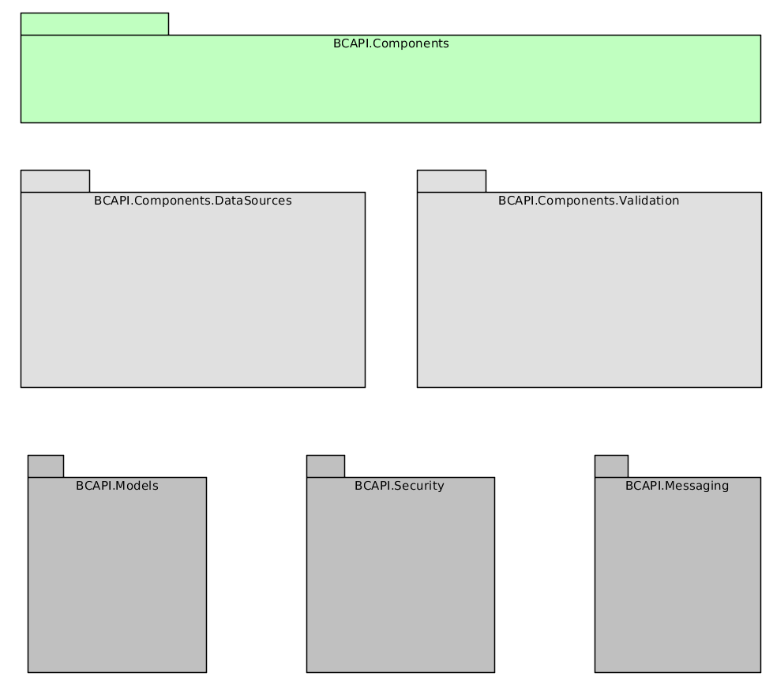

# Introduction

Web apps sdk provides the toolkit for developing applications for Business Catalyst.

## Architecture

The sdk provides all required tools and components for BC developers who want to develop Open Platform applications. Out of the box, all components
provided by the sdk work on all major browsers and support mobile devices.

## SDK Topology

The SDK provides a set of namespaces which group together classes with similar functionality:

* {@link BCAPI.Components}
* {@link BCAPI.Components.DataSources}
* {@link BCAPI.Components.Validation}
* {@link BCAPI.Models}
* {@link BCAPI.Security}
* {@link BCAPI.Messaging}

## Supported browsers

The current prototype of BC UI SDK supports latest versions of all major browsers. We are actively
testing this on:

* Internet Explorer 11
* Chrome
* Firefox
* Safari

# License

Copyright (c) 2012-2015 Adobe Systems Incorporated. All rights reserved.
 
Permission is hereby granted, free of charge, to any person obtaining a
copy of this software and associated documentation files (the "Software"), 
to deal in the Software without restriction, including without limitation 
the rights to use, copy, modify, merge, publish, distribute, sublicense, 
and/or sell copies of the Software, and to permit persons to whom the 
Software is furnished to do so, subject to the following conditions:
 
The above copyright notice and this permission notice shall be included in
all copies or substantial portions of the Software.
 
THE SOFTWARE IS PROVIDED "AS IS", WITHOUT WARRANTY OF ANY KIND, EXPRESS OR
IMPLIED, INCLUDING BUT NOT LIMITED TO THE WARRANTIES OF MERCHANTABILITY, 
FITNESS FOR A PARTICULAR PURPOSE AND NONINFRINGEMENT. IN NO EVENT SHALL THE
AUTHORS OR COPYRIGHT HOLDERS BE LIABLE FOR ANY CLAIM, DAMAGES OR OTHER 
LIABILITY, WHETHER IN AN ACTION OF CONTRACT, TORT OR OTHERWISE, ARISING 
FROM, OUT OF OR IN CONNECTION WITH THE SOFTWARE OR THE USE OR OTHER 
DEALINGS IN THE SOFTWARE.

